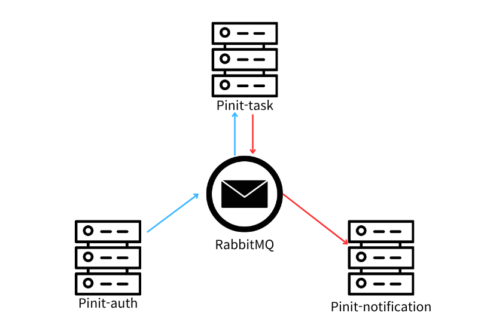

- 도메인 이벤트 - 내부 도메인에서 상태 변화가 일어났음을 알리는 역할
- 애플리케이션 이벤트 - 내부 상태 변화를 외부 시스템과 조율(Orchestration)하는 역할

> **참고**
> 
> 보통은 둘을 엄격히 구분하지 않고, 외부 시스템과 통신하는 도메인 이벤트도 "도메인 이벤트" 라고 불린다.
> 하지만, 이때의 도메인 이벤트는 "우리(바운디드 컨텍스트 내) 도메인 이벤트" 라는 의미로 봄이 바람직하다고 생각한다.
> 사내 문화에 맞게 이해하자!

### 현재 시스템 구조

> 내부 상태 변화(Schedule의 "시작됨" 상태 변화와 "취소됨" 상태 변화)를 외부 시스템이 알아야 하는 경우가 발생했다.

현재 요구사항에는 일정 시작 시간에 푸쉬 알림을 보내야 한다는 요구사항이 있다.

하지만, 이미 일정을 진행중인/종료한 사람에게 해당 푸쉬알림이 발송될 경우, 이는 UX 측면에서 사용자의 집중력을 해칠 우려가 있기 때문에, 일정이 시작된 후에는 푸쉬 알림이 발송되지 않아야 한다.

이렇다면, 일정 시작 시간에 발송되는 푸쉬 알림은 일정이 "시작되지 않음" 상태일 때에만 발송되어야 한다.

즉, 일정의 "시작되지 않음" 관련 상태/상태 변화가 외부 시스템에 전달되어야 한다.

- 도메인 이벤트로 해결하기
  - 상태 변화 알리기 - 일정 시작됨/취소됨
- 도메인 서비스로 해결하기 
  - 근처 시간대 모든 일정에 대해 시작되지 않은 일정을 솎아내 반환하기
  - 근처 일정을 풀스캔하고, 사용자의 알림 구독함/구독하지 않음 설정에 따라 푸쉬 알림 발송 여부를 또 결정해야 한다.

그럼 이제 도메인 이벤트로 이 문제를 해결할 방법을 생각해보자.

### 간단하게 시작하기

이와 같은 경우, 가장 간단한 방법은 다음과 같다.

- 도메인 이벤트에 외부 시스템에 전달할 데이터를 모두 담는다.
- 외부 시스템에 전달할 때, 도메인 이벤트를 그대로 전달한다.

이 방법은 구현이 간단하다는 장점이 있다.
하지만, 다음과 같은 단점이 있다.
- 도메인 이벤트가 외부 시스템에 종속된다.
  - 도메인 이벤트의 변경이 외부 시스템의 변경으로 이어질 수 있다.
- 도메인 이벤트의 크기가 커질 수 있다.
  - 외부 시스템에 전달할 데이터가 많아질수록, 도메인 이벤트의 크기가 커진다.
- 도메인 이벤트를 도메인 내 애그리거트끼리 통신하는데, RabbitMQ와 같은 외부 인프라를 사용하게 된다.
  - 도메인 레이어 자체는 이 사실을 추상화된 인터페이스 덕분에 알지 못하지만, 쓸데없이 성능이 떨어질 수 있다.

따라서 도메인 이벤트와 애플리케이션 이벤트를 분리하는 것이 좋다.

### 이상적인 사용 

- Query 모델과 Command 모델이 이미 분리된 경우, 외부 시스템에는 ID만 전달하고, 외부 시스템이 다시 내부 시스템에 조회 요청을 보내도록 설계하는 것이 좋다. 
- (CQRS 패턴)

**하지만 현재 Pinit의 경우, 현재 시스템에 CQRS가 적용되어 있지 않았다.**

### 타협

- 도메인 이벤트를 받는 별도의 리스너를 추가했다.
- 해당 리스너에서 도메인 이벤트를 애플리케이션 이벤트로 변환하여 외부 시스템에 전달하도록 설계했다.
- 이때, 도메인 이벤트와 애플리케이션 이벤트의 데이터 구조를 분리했다.

일명, "간이 CQRS" 패턴이다.

그런데 이 방식은 이벤트의 payload가 해당 사용자의 API에 종속된다.

즉, 외부에서 필요한 데이터가 변경되면 해당 이벤트의 payload도 변경되어야 한다.

이벤트는 이벤트 자체에 그 상태 변화를 나타내는 것에 집중해야지, 
"필요한 데이터를 요청-응답"하는 형태는 서버-클라이언트 형태의 API 명세가 해야할 일이다.

따라서 장기적으로는 CQRS 패턴을 도입하는 것이 바람직하다.

근데 CQRS 하면 이벤트 소싱이랑 엮어서 이벤트로 상태전이하는거 이야기하지 않나?
조회 DB는 조회만 하고, 명령은 명령대로 처리
명령은 변화를 이벤트로 발행하여, 다른 조회 DB에 전파
이렇게 조회 DB와 명령 DB를 분리

그냥 gRPC만 써서 내부 DB에 readOnly=true 도입

