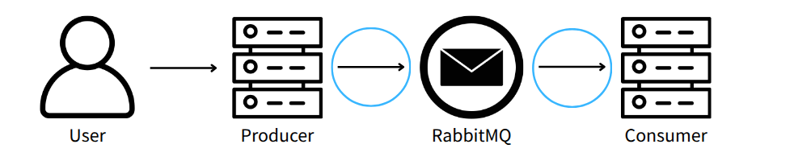
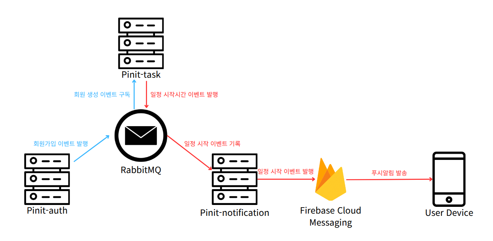

## MSA 환경에서 exactly-once 구현하기

백엔드 서버 관점에서 일반적인 이벤트 발행의 Best Practice를 생각해보자.

> 새로운 방법의 발견이 아닌, 일반적인 방법을 정리하는 것이다.

### 트랜잭셔널 아웃박스 패턴 (Transactional Outbox Pattern)
- 프로듀서 -> MQ 사이의 1회 이상 전송을 보장하는 매커니즘(패턴)
- DB의 트랜잭션은 사용자의 요청과 DB 상태 변경을 원자적으로 묶어준다. 하지만, DB 상태 변경과 이벤트 기록, 그리고 이벤트 발행까지는 원자적으로 묶이지 않는다.
- 트랜잭셔널 아웃박스 패턴은 **DB 상태 변경과 이벤트 기록을 트랜잭션으로 묶는다**. 

하지만, 트랜잭션 아웃박스 패턴은 1회 이상 발행 보장이지, 1회 발행 보장은 아니다.

즉, 중복 발행 가능성이 있다.
- 발행 후 해당 메시지를 발행함을 표기하지 못하고 서버가 다운되는 경우, 재시작 후 동일한 메시지를 다시 발행할 수 있다.

이를 해결하기 위해 멱등 키를 사용하여 중복 제거를 할 수 있다.

### 멱등 키란?

- 이벤트의 수신자 쪽에서 중복된 이벤트를 식별할 수 있는 고유한 키를 말한다.

- 보통 UUID 등을 사용하여 생성한다.

- 해당 이벤트를 받는 쪽에서, 이미 중복된 멱등 키를 처리한 적이 있다면, 해당 이벤트를 무시하도록 구현한다.

여기서 수신자는 현재 MQ가 되겠지만,
- 이를 MQ쪽에서 멱등 키를 관리하도록 하는 건 좋은 유틸리티가 없다.
- 굳이 MQ에서 멱등 키를 관리하기보다는, 컨슈머 쪽에서 멱등 키를 관리해도 "수신자" 입장에서는 동일한 효과를 낼 수 있다.

즉, 여기서 수신자는 컨슈머가 되어,
- 컨슈머가 메시지를 받을 때, 멱등 키를 확인하고, 이미 처리한 적이 있는 멱등 키라면 해당 메시지를 무시한다.

이 두가지를 각 프로듀서-컨슈머 쌍마다 구현해야 한다.

---

현재 pinit 백엔드 프로젝트에는 메시지 큐를 활용하는 이벤트에 크게 두 개의 이벤트 흐름이 있다.

pinit-auth -> pinit-task (회원가입 후 우리 서비스의 사용자 정보 생성 이벤트)
pinit-task -> pinit-notification -> FCM (할 일 시작 시간 알림 이벤트)

하지만 FCM에는 멱등 키를 활용한 중복 제거 기능이 없다.

따라서 이 경우 중복 이벤트 발행 문제를 해결하기 위해서는, 이벤트 흐름을 다음과 같이 수정해야 한다.

pinit-task -> pinit-notification -> FCM -> User Device

User Device를 우리 이벤트의 수신자 입장으로 추가함으로써, 멱등성을 보장하는 로직을 추가할 공간을 만드는 것이다.

웹 푸쉬의 경우, 브라우저에서 오는 푸시 알림은 서비스 워커에서 처리되므로, 서비스 워커에서 멱등 키를 확인하고 중복된 알림을 무시하는 로직을 추가할 수 있다.

https://developer.mozilla.org/en-US/docs/Web/API/ServiceWorkerRegistration/showNotification

그런데 이 방식의 경우, FCM의 Notification 메시지로 푸시 알림을 보내는 경우에는 OS레벨에서 즉시 showNotification 메소드를 사용해 버리므로, 멱등 키를 확인할 새 없이 바로 푸쉬 알림이 보이게 된다.

따라서 이 경우에는, FCM의 Data 메시지로 푸시 알림을 보내고, 서비스 워커에서 해당 Data 메시지를 받아서 멱등 키를 확인한 후에 showNotification 메소드를 호출하는 방식으로 구현해야 한다.

이와 같은 방식으로, 메시지 큐와 FCM Send 간의 동기화를 맞출 수 있다.

